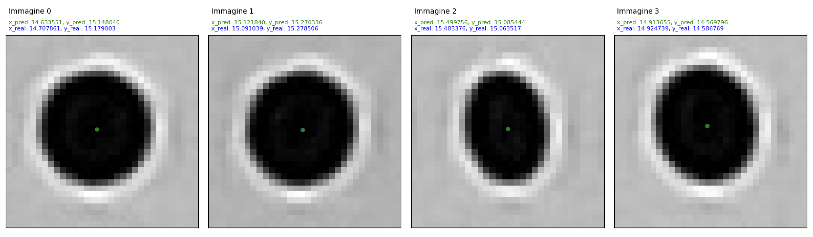

# Marker Center Detection using PyTorch


This PyTorch project demonstrates how to train a neural network to detect the center of ovalised markers in 32x32 images. The trained model can predict the (x, y) coordinates of the center of a ovalised marker within the given image.

## Dataset

The dataset consists of 32x32 images containing ovalised markers. The markers are ovalised as they are cut out of a larger image that is not necessarily aligned with the markers.
Each image is labeled with the ground truth (x, y) coordinates of the center of the ovalised marker.
The dataset consists of a total of 25147 images and is divided into 80% training, 10 validation and 10% test. 

## Make Dataset

The make_dataset.py script is designed to read images and their corresponding center coordinates from text files, crop 32x32 regions around the center coordinates, and save the cropped images along with adjusted center coordinates to an output file.

## Model Architecture

The neural network architecture used in this project is a convolutional neural network (CNN).

## Training

1. Load and preprocess the dataset: for preprocessing is important to normalize the dataset
2. Define the CNN model architecture: the model is a standard CNN with batch normalization
3. Loss function and optimizer: MSE is used as a loss function, Adam as a optimizer

## Evaluation

For accuracy Mean Average Error is used.
If you wanna evaluate your model you can launch
```bash
python main.py --model_name MODEL_NAME --mode evaluate --dataset_path DATASET_PATH --annotations_file ANNOTATIONS_FILE
```
During our studies the best model reached a MAE of 0.03

## Test

```bash
python main.py --model_name MODEL_NAME --mode test --dataset_path DATASET_PATH --annotations_file ANNOTATIONS_FILE
```

